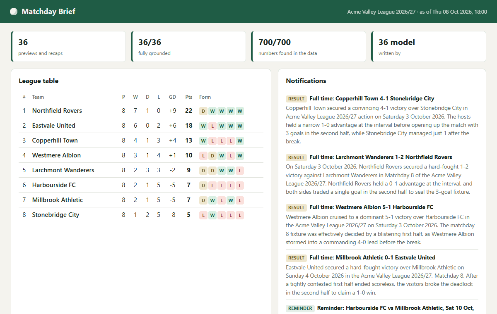
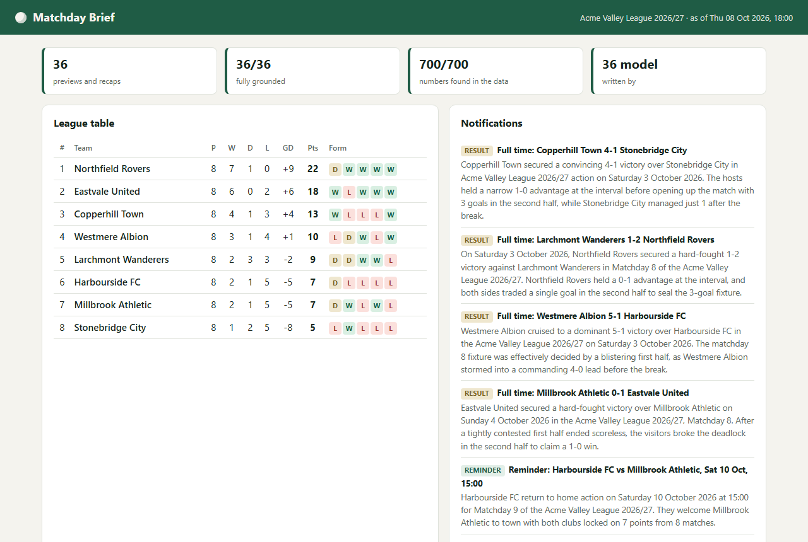
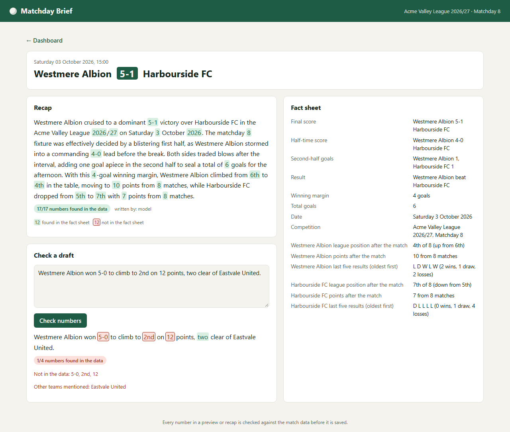
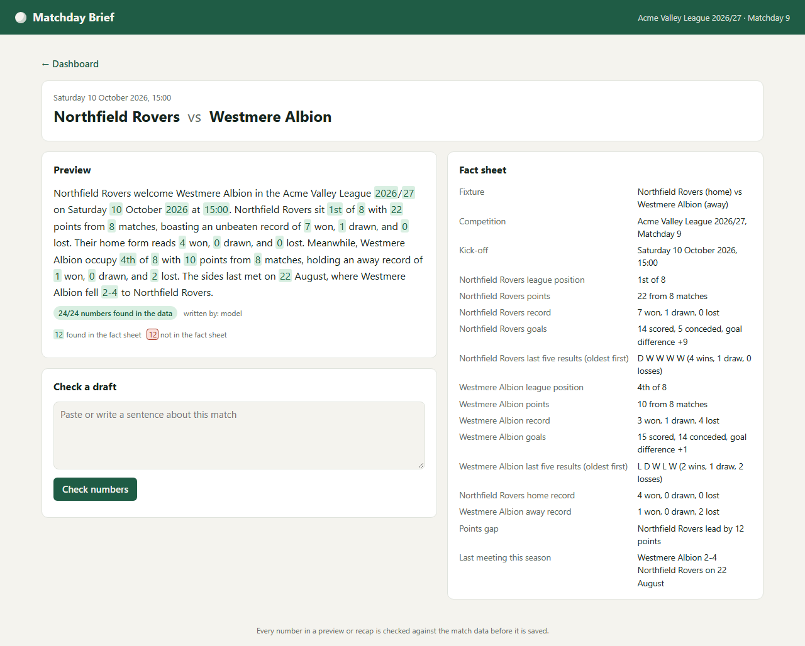
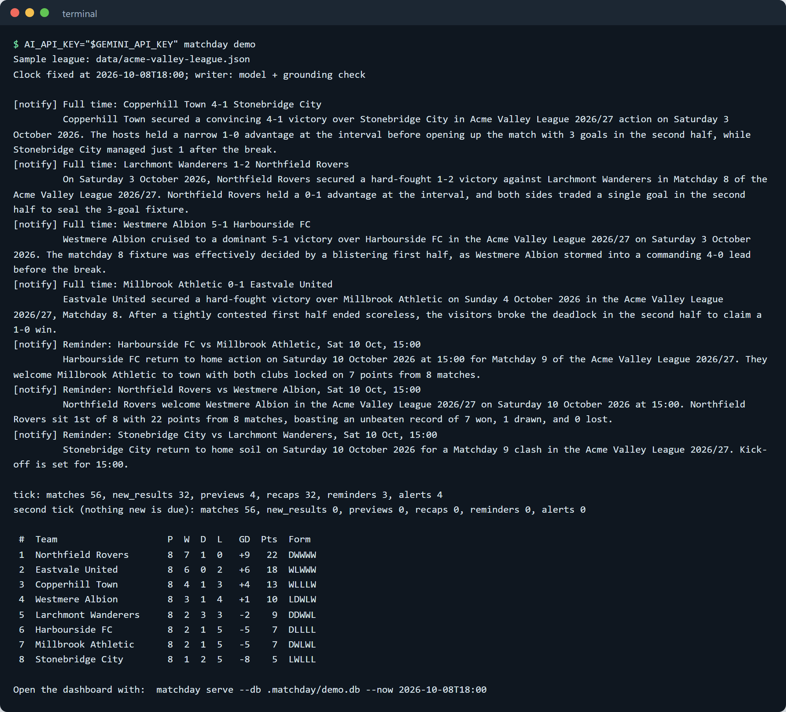
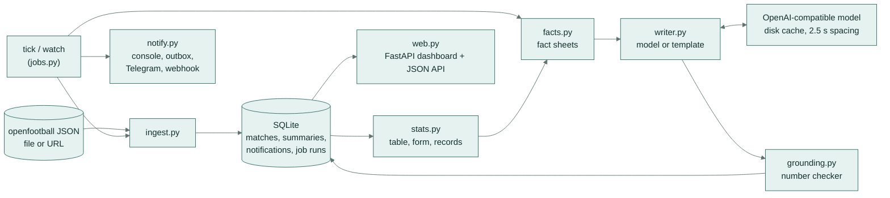
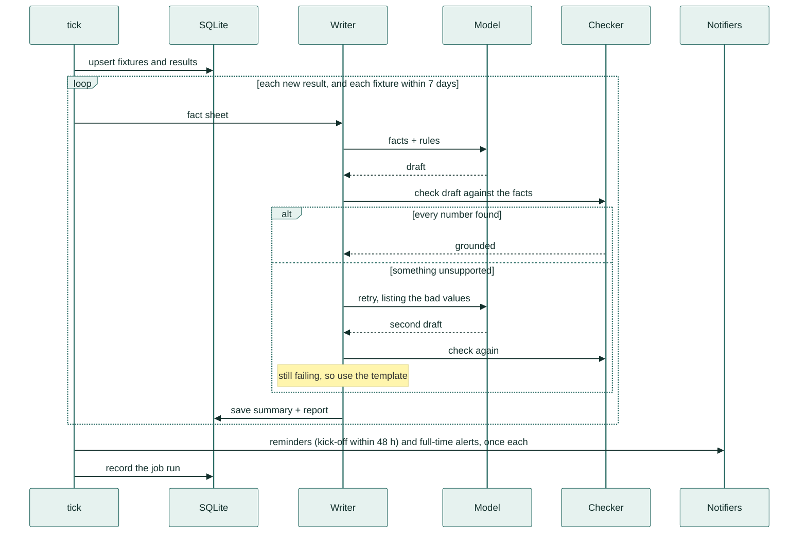

# Matchday Brief



A fixtures and results tracker for a football league. It sends match reminders and full-time alerts, and it writes
short AI previews and recaps. Before any of that text is saved or sent, a checker confirms that **every number in it
comes from the match data**.

## What it does

- **Tracks a league.** It loads fixtures and results from free, public-domain [openfootball](https://github.com/openfootball/football.json)
  JSON files (a file or a URL) and keeps the league table, form, home and away records and head-to-head results in SQLite.
- **Runs on a schedule.** One `tick` refreshes the data and does whatever has become due. `watch` repeats it on an interval.
- **Sends reminders and alerts.** It sends a reminder before a followed team's kick-off and an alert at full time. Each
  goes out once, to the console, a JSON outbox, Telegram or a webhook.
- **Writes previews and recaps.** Each one is built from a fact sheet: the score, the table, form, records and the last
  meeting. Any OpenAI-compatible model can write it (Gemini by default), or a built-in template if there is no API key.
- **Checks every number.** It pulls every number, scoreline, time, position and named team out of the text and checks
  each against the fact sheet. Text that fails gets one retry with the bad values listed, and after that the
  template is used instead. Nothing ungrounded is published.
- **Shows it all on a dashboard.** The dashboard shows the table, upcoming fixtures, results, sent notifications and job
  runs. Each summary has its numbers highlighted, and a box lets you check any draft against the same facts.

## A real-life example

Maya Okafor edits the weekly newsletter for her town's amateur football league. She wants a preview of each weekend
fixture by Thursday and a recap of each result by Monday. She is tired of fixing scores that a writing tool made up.

She points Matchday Brief at the league's fixtures file, follows her own club and schedules `matchday tick` every 15
minutes. During the week before the weekend, previews appear on the dashboard. Two days before her club's Saturday
15:00 kick-off, a reminder reaches the committee's Telegram group. After the final whistle the recap and a
"Full time" alert follow. Every number in the newsletter text has been matched to the results table: points,
positions, the half-time score and the date of the last meeting. If the model writes "won 5-0" when the score was
5-1, the draft is rejected before anyone sees it.

## How you would use it

1. Run `matchday demo --serve` to see a full sample season on the dashboard.
2. Point `MATCHDAY_SOURCE` at your league's openfootball file or URL and pick the teams to follow.
3. Choose where alerts go (`MATCHDAY_NOTIFY=telegram`, for example) and run `matchday watch` on a server, or
   `matchday tick` from cron.
4. Optionally set `AI_API_KEY` for model-written text. Without it, the template writer is used and everything else
   still works.

## Screenshots

| Dashboard | Checking a draft |
| --- | --- |
|  |  |

| Preview with its fact sheet | One scheduled run (`matchday demo`) |
| --- | --- |
|  |  |

The full dashboard page is in [docs/screenshots/dashboard.png](docs/screenshots/dashboard.png), and the checker
evaluation output is in [docs/screenshots/eval-checker.png](docs/screenshots/eval-checker.png).

## How it works

1. **Ingest.** `ingest.py` reads openfootball JSON from a file or URL and turns it into `Match` records with kick-off,
   full-time and half-time scores. `store.py` upserts them into SQLite and counts the results that are new.
2. **Compute.** `stats.py` builds the table at any point in time (points, then goal difference, then goals scored), plus
   form over the last five, home and away records, meetings and unbeaten runs.
3. **Build a fact sheet.** `facts.py` writes everything a summary may say as labelled facts. A preview uses only the
   results before kick-off. A recap uses the table straight after the match, and the position before it, to show
   movement.
4. **Write.** `writer.py` sends the fact sheet to the model with instructions to use only those values, in 70 to 110
   words. With no key, or on any API error, the template writer builds the text from the fact values directly.
5. **Check.** `grounding.py` extracts each numeric claim and looks it up in the same sheet. Scorelines must match as a
   pair, positions must match a league position, and "N points" must match a points value. It also flags any other
   team in the league that is named.
6. **Retry or fall back.** An ungrounded draft gets one retry that names the unsupported values. If the retry also
   fails, the template is used. The stored summary keeps its source (`model`, `model-retry` or `template`) and its
   check report.
7. **Notify.** Fixtures inside the reminder window and results inside the alert window go to every configured channel
   once. Duplicates are prevented by a `(match, kind)` key in SQLite, and one failing channel does not stop the others.
8. **Show.** `web.py` (FastAPI and Jinja2) renders the dashboard and match pages, with JSON endpoints for the table and
   for summaries.

## Architecture



## Main flow: one scheduled run



## The grounding check

| Claim in the text | Must match in the fact sheet |
| --- | --- |
| `22`, `1.75`, `62%`, `+9` | the same number anywhere in the sheet |
| `two`, `twelve` (number words from two to twenty) | the same number |
| `5-1`, `1-2` | the same scoreline, as a pair (either order) |
| `15:00` | the same kick-off time |
| `4th`, `third`, `second place` | a league position |
| `12 points`, `a 12-point lead` | a points total or the points gap |
| another team from the league | not allowed |

"One", "first half", "fourth defeat in five" and "3rd October" are read as ordinary words, counts or dates, not as
league positions.

## Evaluation

**Checker accuracy on labelled summaries** (`matchday eval checker`, data in `eval/checker_cases.jsonl`, runs in CI):

| Case set | Cases | Correct |
| --- | --- | --- |
| Template summaries (grounded) | 32 | 32 |
| One number or scoreline changed to a value not in the sheet | 64 | 64 |
| Another league team mentioned | 32 | 32 |
| Hand-written sentences, labelled by hand | 51 | 46 |
| **All** | **179** | **174 (97.2%)** |

On flagging ungrounded text, precision is **100%** (no grounded case was flagged) and recall is **96.0%**. The five
cases it misses are wrong claims whose number happens to be right for something else in the same sheet: a count
("won three of their last five" when it was two), another team's position, an invented statistic, and "second"
without a place word. That is the limit of matching numbers rather than meanings.

**Model-written summaries** (`matchday eval writer`, `gemini-flash-lite-latest`, 12 recaps and 12 previews from the
sample league, results in `eval/results/writer.json`):

| Measure | Result |
| --- | --- |
| First drafts fully grounded | 23 of 24 |
| Numbers in first drafts found in the data | 475 of 476 (99.8%) |
| Published by the model on the first try / after one retry / by the template | 23 / 1 / 0 |
| Published summaries fully grounded | **24 of 24** |
| Mean length | 101.5 words |

The one rejected draft described a "4-4 goal winning margin" for a 5-1 win, and the retry fixed it.

**Human review** (`eval/results/writer_review.json`): 8 of the published summaries, 4 recaps and 4 previews with 151
numbers between them, were read line by line against their fact sheets. Non-numeric claims were checked too, such as
"the visitors broke the deadlock", "second consecutive defeat" and "searching for their first away victory". None
contained a factual error.

The demo run shown above wrote 36 summaries with the model. All 700 of their numbers were found in the data.

## Tech stack

- **Python 3.11+**, standard-library `sqlite3`, `urllib` and `argparse`
- **FastAPI**, **Jinja2** and **Uvicorn** for the dashboard and JSON API
- **openai** client against any OpenAI-compatible endpoint (Gemini by default), with an on-disk response cache and at
  least 2.5 s between calls
- **pytest**, **ruff** and **mypy --strict**, with GitHub Actions CI on Python 3.11 to 3.13
- Data: openfootball JSON (public domain); the bundled sample league is generated by `tools/make_sample.py`

## Setup

```bash
git clone <this repo> && cd matchday-brief
python -m venv .venv && source .venv/bin/activate     # Windows: .venv\Scripts\activate
pip install -e ".[dev]"                               # one command to set up
matchday demo --serve                                 # one command to run the demo, then open http://127.0.0.1:8000
```

The demo loads a fictional eight-team season (`data/acme-valley-league.json`, 56 fixtures, 32 played). It fixes the
clock at 2026-10-08 18:00 and runs the scheduled job twice. The second run shows that nothing is sent twice. Then it
prints the table. To have the model write the text, add a key for that run only:

```bash
AI_API_KEY="$GEMINI_API_KEY" matchday demo --serve
```

## Configuration

All settings are environment variables. Command-line flags override them.

| Variable | Purpose | Default |
| --- | --- | --- |
| `AI_API_KEY` | key for the model provider; without it the template writer is used | unset |
| `AI_BASE_URL` | OpenAI-compatible endpoint | `https://generativelanguage.googleapis.com/v1beta/openai` |
| `AI_MODEL` | model name | `gemini-flash-lite-latest` |
| `MATCHDAY_SOURCE` | openfootball JSON file or URL | the bundled sample league |
| `MATCHDAY_DB` | SQLite path | `.matchday/matchday.db` |
| `MATCHDAY_TEAMS` | comma-separated teams to follow (empty means all) | all |
| `MATCHDAY_NOTIFY` | channels: `console`, `outbox`, `telegram`, `webhook` | `console` |
| `MATCHDAY_OUTBOX` | JSON-lines file for the `outbox` channel | `.matchday/outbox.jsonl` |
| `TELEGRAM_BOT_TOKEN`, `TELEGRAM_CHAT_ID` | needed for the `telegram` channel | unset |
| `MATCHDAY_WEBHOOK_URL` | https endpoint for the `webhook` channel | unset |
| `MATCHDAY_NOW` | fixed clock in ISO format, for demos and replays | real time |

Reminders go out 48 hours before kick-off. Previews are written for fixtures in the next 7 days, and full-time alerts
cover results from the last 7 days. These windows are fields of `jobs.Settings`.

## Usage

```bash
matchday tick                                   # run the scheduled job once (for cron)
matchday watch --every 900                      # run it every 15 minutes
matchday tick --team "Northfield Rovers" --notify console,outbox
matchday serve --port 8000                      # dashboard
matchday table                                  # league table in the terminal
matchday show 2026-10-10-northfield-rovers-westmere-albion --facts   # write one summary and print its check
matchday eval checker                           # labelled checker evaluation (offline)
AI_API_KEY="$GEMINI_API_KEY" matchday eval writer   # model evaluation (calls the model)
```

To use a real league, point the source at an openfootball season file:

```bash
export MATCHDAY_SOURCE=https://raw.githubusercontent.com/openfootball/football.json/master/2024-25/en.1.json
matchday tick --no-model && matchday table
```

A full 380-match, 20-team top-division season from openfootball loads this way, and template recaps for its last 60
matches all pass the check.

JSON endpoints: `GET /api/table`, `GET /api/summaries/{match_id}` (text, source, check report and facts), `GET /healthz`.

## Project structure

```
matchday-brief/
├── src/matchday/
│   ├── cli.py            # matchday demo | tick | watch | serve | table | show | eval
│   ├── ingest.py         # openfootball JSON from a file or URL
│   ├── models.py         # Match
│   ├── stats.py          # table, form, home/away records, meetings, unbeaten runs
│   ├── facts.py          # preview and recap fact sheets
│   ├── grounding.py      # claim extraction and the number checker
│   ├── writer.py         # template, model and grounded (retry + fallback) writers
│   ├── llm.py            # OpenAI-compatible client, disk cache, call spacing
│   ├── jobs.py           # the scheduled tick and the watch loop
│   ├── notify.py         # console, outbox, Telegram, webhook
│   ├── store.py          # SQLite
│   ├── web.py            # FastAPI dashboard and JSON API
│   ├── evaluate.py       # checker and writer evaluations
│   ├── templates/        # Jinja2 pages
│   └── static/style.css
├── data/acme-valley-league.json   # fictional sample season
├── eval/
│   ├── checker_cases.jsonl        # 179 labelled cases
│   └── results/                   # checker.json, writer.json, writer_review.json
├── tools/
│   ├── make_sample.py             # generates the sample season (fixed seed)
│   └── make_checker_cases.py      # generates the labelled checker cases
├── tests/                          # pytest suite
├── docs/                           # demo GIF and screenshots
└── .github/workflows/ci.yml
```

## Tests and CI

```bash
ruff check . && ruff format --check .
mypy
pytest -q
```

There are 42 tests. They cover:

- ingest, for both the current and the older openfootball formats;
- table maths and tie-breaks;
- claim extraction and the typed checks;
- every writer path: model, retry, template fallback and API error;
- the LLM cache and call spacing;
- the scheduled job: counts, de-duplication, followed teams, the reminder window and a failing channel;
- notifier configuration, the dashboard and API, and the demo command;
- a minimum bar for the checker evaluation.

Tests remove `AI_API_KEY` and use scripted models, so CI never calls a model. The CI workflow runs the same commands
on Python 3.11, 3.12 and 3.13, then runs `matchday eval checker`.

## Licence

MIT. See [LICENSE](LICENSE).
